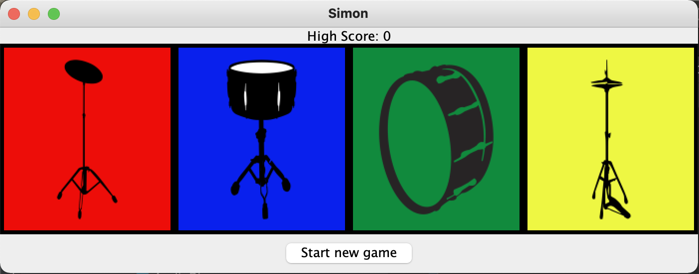

# Simon Drums
An implementation of the classic game, Simon, but 
using drums and their sounds instead. The game challenges
the user to remember not only the drum sequence that was
played, but also the sound each drum makes - so that they
can replay the sequence.

Try it yourself with this [jar](build/libs/Simon Drums-1.0-SNAPSHOT.jar)!

#### Contributors
[Tamar Aufrichtig](https://github.com/TamarAuf/Simon-Drums)  
[Michelle Berger](https://github.com/bergerm613/Simon-Drums)  
[Mindy Gottlieb](https://github.com/Mindy712/Simon-Drums)
